# unified-task
Defined the unified task structure.

## 任务组织形式

整个系统的任务组织形式为一个树状结构。



蓝色表示管理任务，不代表执行流，它们负责资源管理、以及子任务管理，包括 hypervisor、os、process。

灰色表示执行流任务，在每个管理任务下都存在者各自的执行流，包括 thread、coroutine。

## 任务上下文结构

```rust
#[repr(C)]
#[derive(Debug)]
pub struct TaskContext {
    /// 
    pub x: [usize; 31],
    ///
    pub addrspace_token: usize,
    /// 
    pub free_sp: usize,
    /// 
    pub schedule_fn: usize,
    /// 
    pub priv_info: PrivInfo,
}

#[repr(C)]
#[derive(Debug)]
pub enum PrivInfo {
    SPrivilige(SPrivilige),
    UPrivilige(UPrivilige),
    UnKnown
}

#[repr(C)]
#[derive(Debug)]
pub struct SPrivilige {
    pub sstatus: usize,
    pub sepc: usize,
    pub stvec: usize,
    pub sie: usize,
}

#[repr(C)]
#[derive(Debug)]
pub struct UPrivilige {
    pub ustatus: usize,
    pub uepc: usize,
    pub utvec: usize,
    pub uie: usize,
}
```

## 任务执行流（上下文）切换


